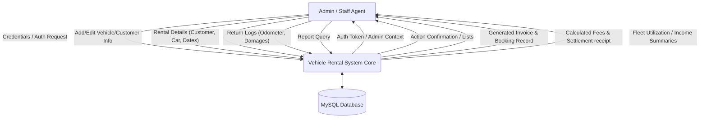

# System Design Diagrams

This document contains standard Mermaid diagrams representing the architecture, interactions, database structures, and information flow within the Vehicle Rental Management System.

---

## 1. Entity-Relationship Diagram (ERD)

Shows the normalized relational model mapping categories, vehicles, customers, rentals, payments, invoices, returns, and administrative operators.

```mermaid
erDiagram
    ADMINS ||--o{ RENTALS : "creates"
    ADMINS ||--o{ RETURNS : "processes"
    CATEGORIES ||--o{ VEHICLES : "contains"
    VEHICLES ||--o{ RENTALS : "assigned_to"
    CUSTOMERS ||--o{ RENTALS : "books"
    RENTALS ||--|| INVOICES : "billing_for"
    RENTALS ||--o{ PAYMENTS : "paid_by"
    RENTALS ||--o| RETURNS : "settled_by"

    ADMINS {
        int admin_id PK
        string username UNIQUE
        string password_hash
        string email UNIQUE
        string name
        string role
        string status
        timestamp created_at
    }

    CATEGORIES {
        int category_id PK
        string name UNIQUE
        text description
        decimal daily_rate
        decimal late_fee_per_hour
        decimal deposit_amount
    }

    VEHICLES {
        int vehicle_id PK
        string make
        string model
        int year
        string license_plate UNIQUE
        string color
        int category_id FK
        string status
        string image_url
        int mileage
        string fuel_type
        string transmission
    }

    CUSTOMERS {
        int customer_id PK
        string first_name
        string last_name
        string email UNIQUE
        string phone
        string license_number UNIQUE
        string status
        timestamp created_at
    }

    RENTALS {
        int rental_id PK
        int customer_id FK
        int vehicle_id FK
        timestamp booking_date
        datetime start_date
        datetime end_date
        datetime actual_return_date
        decimal total_cost
        string status
        int created_by_admin_id FK
    }

    INVOICES {
        int invoice_id PK
        int rental_id FK
        string invoice_number UNIQUE
        timestamp issue_date
        datetime due_date
        decimal subtotal
        decimal tax_amount
        decimal discount_amount
        decimal total_amount
        string status
      }

    PAYMENTS {
        int payment_id PK
        int rental_id FK
        timestamp payment_date
        decimal amount
        string payment_method
        string status
        string transaction_reference
    }

    RETURNS {
        int return_id PK
        int rental_id FK
        timestamp return_date
        int mileage_in
        string fuel_level_in
        text damage_notes
        int late_hours
        decimal late_fee
        decimal damage_charges
        decimal additional_charges
        decimal total_refund_deducted
        decimal final_amount_paid
        int processed_by_admin_id FK
    }
```

---

## 2. Use Case Diagram

Displays operations accessible to system administrators and staff operators.

```mermaid
usecaseDiagram
    actor "Admin/Staff" as Admin
    
    rectangle "Vehicle Rental Management System" {
        usecase "Authenticate Admin (Login)" as UC1
        usecase "Manage Vehicles Fleet (CRUD)" as UC2
        usecase "Manage Customers Profile" as UC3
        usecase "Create Rental Booking (Checkout)" as UC4
        usecase "Process Returns (Check-In)" as UC5
        usecase "Calculate Late Fees" as UC6
        usecase "Generate Invoice & Bill" as UC7
        usecase "View Utilization & Income Reports" as UC8
    }

    Admin --> UC1
    Admin --> UC2
    Admin --> UC3
    Admin --> UC4
    Admin --> UC5
    Admin --> UC8

    UC4 ..> UC7 : "<<includes>>"
    UC5 ..> UC6 : "<<includes>>"
    UC5 ..> UC7 : "<<includes>>"
```

---

## 3. Data Flow Diagram Level 0 (Context Diagram)

Displays inputs and outputs exchanging between the Admin Agent and the core System Boundaries.



---

## 4. Data Flow Diagram Level 1 (Process Detail Diagram)

Displays processes within the system boundaries and their read/write links to database tables.

```mermaid
graph TD
    Admin[Admin/Staff]
    
    subgraph Processes
        P1(1.0 Login Auth)
        P2(2.0 Fleet CRUD)
        P3(3.0 Customer Registry)
        P4(4.0 Rental Booking Process)
        P5(5.0 Return Inspection Processing)
        P6(6.0 Report Audits Engine)
    end
    
    subgraph Data Stores
        DS1[(admins table)]
        DS2[(vehicles table)]
        DS3[(categories table)]
        DS4[(customers table)]
        DS5[(rentals table)]
        DS6[(invoices table)]
        DS7[(returns table)]
        DS8[(payments table)]
      end

    Admin -->|Username/Password| P1
    P1 -->|Query User| DS1
    P1 -->|Verify & Return JWT| Admin

    Admin -->|Vehicle Spec & Status| P2
    P2 -->|Create/Update/Retire| DS2
    P2 -->|Read rate guidelines| DS3
    P2 -->|Render Fleet grid| Admin

    Admin -->|Customer Demographics| P3
    P3 -->|Register/Suspend| DS4
    P3 -->|Render profiles| Admin

    Admin -->|Dates, Cust, Car Selection| P4
    P4 -->|Check active status| DS4
    P4 -->|Check car available| DS2
    P4 -->|Write booking| DS5
    P4 -->|Trigger status to rented| DS2
    P4 -->|Create Invoice| DS6
    P4 -->|Return receipt| Admin

    Admin -->|Odometer In, Inspect logs| P5
    P5 -->|Read rental details| DS5
    P5 -->|Query fee factors| DS3
    P5 -->|Write return summary| DS7
    P5 -->|Trigger status to available/maintenance| DS2
    P5 -->|Update invoices & insert payment| DS6
    P5 -->|Return Balance sheet| Admin

    Admin -->|Query revenue metrics| P6
    P6 -->|Query analytics views| DS2
    P6 -->|Query totals| DS8
    P6 -->|Export reports data| Admin
```


